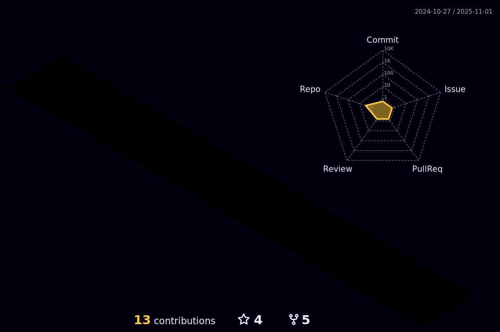

<h1 align="center">Hi , I am HY Lim </h1>
<h3 align="center">Fullstack Developer | Lifelong learner</h3>

<h3>
&nbsp;Language and Framework:
</h3>

&nbsp;

&nbsp;

&nbsp;

&nbsp;

&nbsp;

&nbsp;

&nbsp;

&nbsp;

&nbsp;

&nbsp;

&nbsp;

&nbsp;

&nbsp;

&nbsp;

&nbsp;

&nbsp;

 
 
 
 
 

<h3>
&nbsp;Programming and DevOps Tools:
</h3>

&nbsp;

&nbsp;

&nbsp;

&nbsp;

&nbsp;

&nbsp;

&nbsp;

&nbsp;

&nbsp;

&nbsp;

&nbsp;

&nbsp;

&nbsp;

&nbsp;

&nbsp;

 

<h2>
 &nbsp;<i><b>Git Activeness</b></i>

</h2>

&nbsp;

<h2>
&nbsp;<i><b>Git Profile Trophies<i><b>
</h2>

 
 

